# Log Reporter Class Diagram

## Overview

The Log Reporter is a comprehensive tool for log analysis and problem resolution. It consists of three main components:

1. **LogScanner**: Identifies issues in logs by detecting keywords or stack traces
2. **ProblemResolver**: Analyzes source code and uses LLMs to suggest fixes
3. **ReportGenerator**: Creates HTML reports based on a template

## Class Diagram

```mermaid
classDiagram
    class LogScanner {
        -logPatterns: Map~string, RegExp~
        -stackTracePatterns: RegExp[]
        -issues: Issue[]
        +constructor(config: ScannerConfig)
        +scanLogFile(filePath: string): Promise~Issue[]~
        +scanLogDirectory(dirPath: string): Promise~Issue[]~
        +scanLogContent(content: string): Issue[]
        +getIssues(): Issue[]
    }
    
    class Issue {
        +id: string
        +type: string
        +severity: string
        +message: string
        +stackTrace: string
        +timestamp: Date
        +source: string
        +lineNumber: number
        +context: string[]
        +constructor(data: IssueData)
        +toString(): string
    }
    
    class ProblemResolver {
        -llmClient: LLMClient
        -sourceCodeFinder: SourceCodeFinder
        -solutions: Map~string, Solution~
        +constructor(config: ResolverConfig)
        +resolveIssue(issue: Issue): Promise~Solution~
        +batchResolveIssues(issues: Issue[]): Promise~Solution[]~
        +getSolutions(): Solution[]
    }
    
    class Solution {
        +issueId: string
        +recommendation: string
        +codeSnippet: string
        +confidence: number
        +references: string[]
        +constructor(data: SolutionData)
    }
    
    class SourceCodeFinder {
        -sourceRoots: string[]
        -fileExtensions: string[]
        +constructor(config: SourceFinderConfig)
        +findSourceForStackTrace(stackTrace: string): Promise~SourceInfo~
        +findRelevantCode(issue: Issue): Promise~SourceInfo~
    }
    
    class LLMClient {
        -apiKey: string
        -endpoint: string
        -model: string
        +constructor(config: LLMConfig)
        +generateSolution(issue: Issue, sourceCode: SourceInfo): Promise~string~
    }
    
    class ReportGenerator {
        -templatePath: string
        -outputDir: string
        +constructor(config: ReportConfig)
        +generateReport(issues: Issue[], solutions: Solution[]): Promise~string~
        +generateSummary(issues: Issue[], solutions: Solution[]): ReportSummary
    }
    
    class ReportSummary {
        +totalIssues: number
        +resolvedIssues: number
        +issuesByType: Map~string, number~
        +issuesBySeverity: Map~string, number~
    }
    
    class ConfigManager {
        -configPath: string
        -config: Config
        +constructor(configPath: string)
        +loadConfig(): Promise~Config~
        +getLogScannerConfig(): ScannerConfig
        +getProblemResolverConfig(): ResolverConfig
        +getReportGeneratorConfig(): ReportConfig
    }
    
    LogScanner --> Issue : creates
    ProblemResolver --> Solution : creates
    ProblemResolver --> LLMClient : uses
    ProblemResolver --> SourceCodeFinder : uses
    ReportGenerator --> ReportSummary : creates
    LogScanner ..> ConfigManager : uses config
    ProblemResolver ..> ConfigManager : uses config
    ReportGenerator ..> ConfigManager : uses config
```

## Component Interactions

1. **LogScanner**
   - Processes log files to identify issues based on patterns
   - Creates Issue objects containing problem details
   - Can scan individual files, directories, or raw content

2. **ProblemResolver**
   - Takes Issues from LogScanner
   - Uses SourceCodeFinder to locate relevant code
   - Leverages LLMClient to generate solution recommendations
   - Creates Solution objects with fix suggestions

3. **ReportGenerator**
   - Takes Issues and Solutions as input
   - Uses an HTML template to create a comprehensive report
   - Generates summary statistics about issues and solutions
   - Outputs an HTML report with problem-resolution pairs

## Configuration

The ConfigManager handles loading and providing configuration for all components:

- Scanner patterns and sensitivity
- Source code repository locations
- LLM API credentials and parameters
- Report template paths and styling

This architecture provides a flexible, modular system for log analysis, problem resolution, and reporting.
